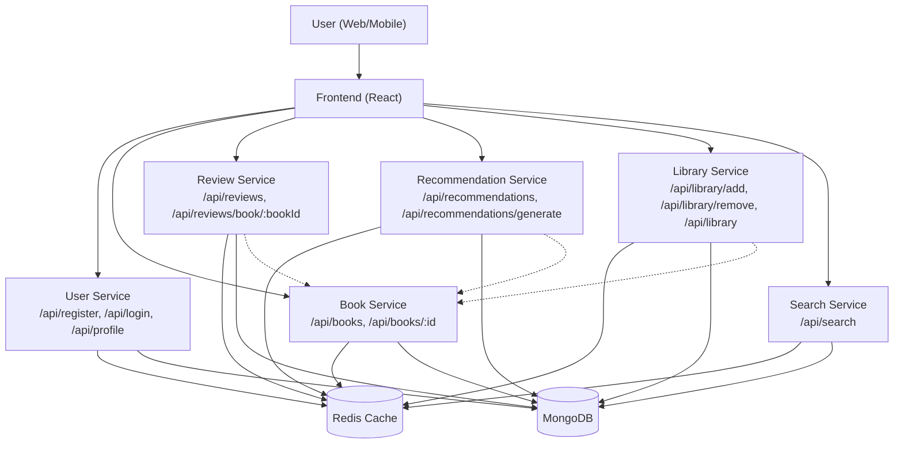
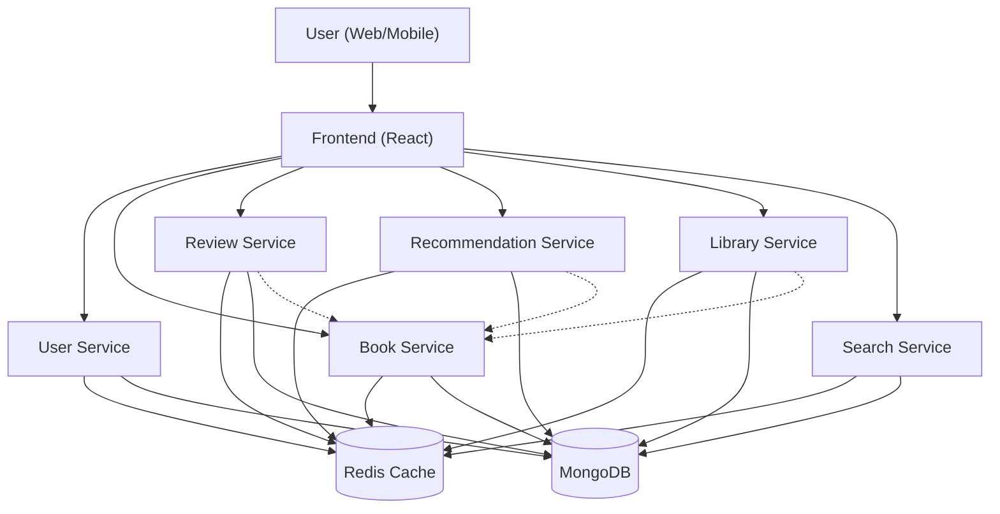

# BookVerse Microservices Overview

## Architecture Diagram

---

## Data Storage & Caching Architecture

---

## How Each Service Uses Redis and MongoDB

### User Service
- **MongoDB:** Stores user accounts, credentials, and profile data.
- **Redis:** Caches session tokens (JWT), manages login sessions for fast authentication.

### Book Service
- **MongoDB:** Stores all book data (title, author, genre, etc.).
- **Redis:** Caches book lists and featured books for fast retrieval.

### Review Service
- **MongoDB:** Stores all book reviews.
- **Redis:** Implements rate-limiting for review submissions and can cache review data.

### Recommendation Service
- **MongoDB:** Stores user-specific recommendation lists.
- **Redis:** Caches generated recommendations for quick access.

### Library Service
- **MongoDB:** Stores each user's personal library (books added, categories, favorites).
- **Redis:** Caches library data per user for fast dashboard/library loading.

### Search Service
- **MongoDB:** Stores book data and supports text/field search queries.
- **Redis:** Caches search results for repeated queries to improve performance.

---

## Service Functions and API Endpoints

### User Service
- **register(data):** Registers a new user. [POST /api/register]
- **login(email, password):** Authenticates a user and returns JWT. [POST /api/login]
- **getProfile(id):** Returns user profile (no password). [GET /api/profile]

### Book Service
- **getAllBooks():** Returns all books. [GET /api/books]
- **getBookById(id):** Returns details for a specific book. [GET /api/books/:id]
- **createBook(data):** Adds a new book. [POST /api/books]
- **updateBook(id, data):** Updates a book. [PUT /api/books/:id]
- **deleteBook(id):** Deletes a book. [DELETE /api/books/:id]
- **getFeaturedBooks():** Returns featured books. [GET /api/books/featured]

### Review Service
- **createReview(data):** Posts a review for a book (rate-limited). [POST /api/reviews]
- **updateReview(id, userId, data):** Updates a review. [PUT /api/reviews/:id]
- **deleteReview(id, userId):** Deletes a review. [DELETE /api/reviews/:id]
- **getReviewsByBook(bookId):** Gets all reviews for a book. [GET /api/reviews/book/:bookId]

### Recommendation Service
- **generateRecommendations(userId):** Generates and caches recommendations for a user. [POST /api/recommendations/generate]
- **getRecommendations(userId):** Gets recommendations for a user. [GET /api/recommendations]

### Library Service
- **addBook(userId, bookId, category):** Adds a book to user's library. [POST /api/library/add]
- **removeBook(userId, bookId):** Removes a book from user's library. [POST /api/library/remove]
- **updateCategory(userId, bookId, category):** Updates a book's category in library. [POST /api/library/updateCategory]
- **toggleFavourite(userId, bookId):** Toggles favourite status for a book. [POST /api/library/toggleFavourite]
- **getLibrary(userId):** Gets the user's library. [GET /api/library]

### Search Service
- **searchBooks(query, filters):** Searches books by query and filters (genre, author, rating, price, etc). [GET /api/search]

---

## Service Connections
- All services are accessed via REST API calls from the frontend (React app).
- Some services (Recommendation, Library, Review) may read book data directly from the Book Service database (not via HTTP), for performance and data consistency.
- No direct HTTP calls between services; all user actions go through the frontend.

---

## API Endpoints Table

See [BookVerse_API_Endpoints.md](./BookVerse_API_Endpoints.md) for a full list of endpoints and descriptions. 

---

## Additional Dependencies

The following packages are used across various services and the frontend. If you encounter errors about missing modules, install them using npm or yarn:

- **ioredis**: Used for connecting to Redis in backend services.
  - Install: `npm install ioredis`
- **axios**: Used in the frontend (and sometimes backend) for making HTTP requests.
  - Install: `npm install axios`
- **cors**: Enables Cross-Origin Resource Sharing in Express APIs.
  - Install: `npm install cors`
- **dotenv**: Loads environment variables from `.env` files.
  - Install: `npm install dotenv`
- **bcrypt**: Password hashing for user authentication.
  - Install: `npm install bcrypt`
- **swagger-ui-express** and **swagger-jsdoc**: For API documentation.
  - Install: `npm install swagger-ui-express swagger-jsdoc`
- **mongoose**: MongoDB object modeling for Node.js.
  - Install: `npm install mongoose`

> **Note:** Always check each service's `package.json` and install any missing dependencies if you get module not found errors. 